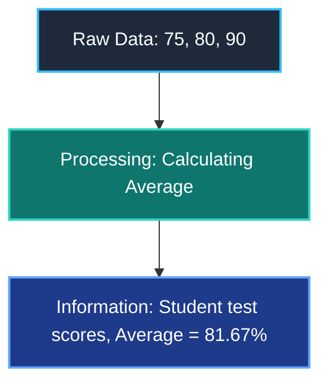
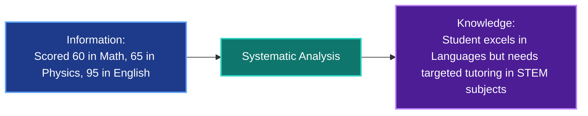
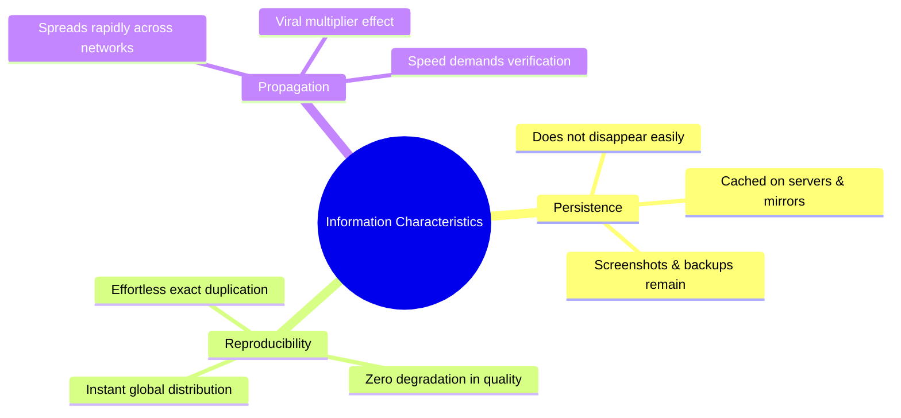
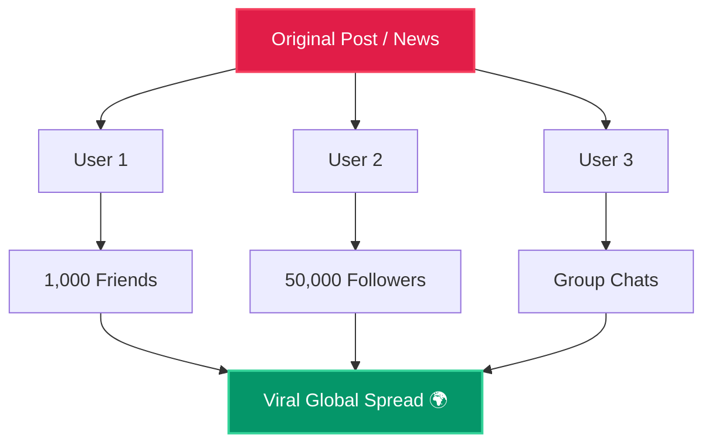
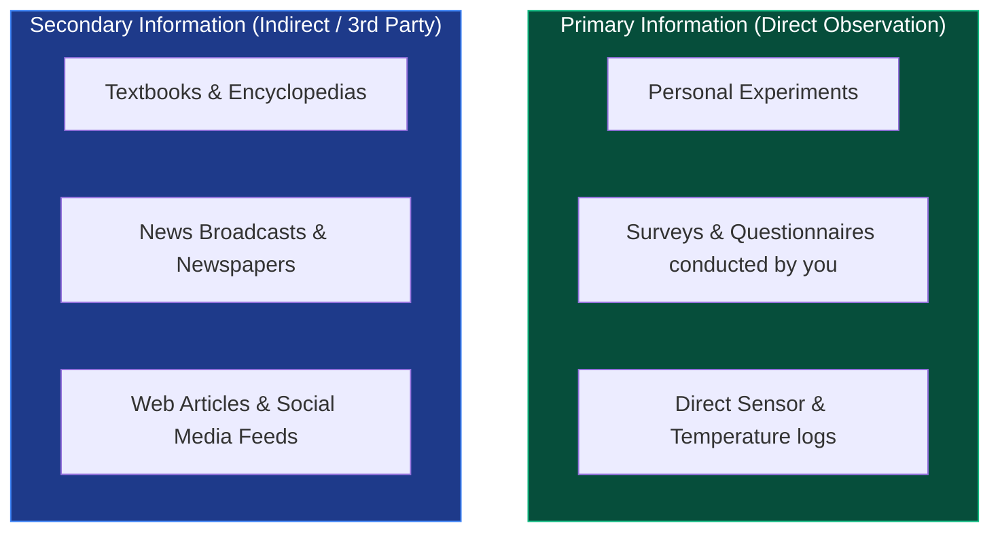
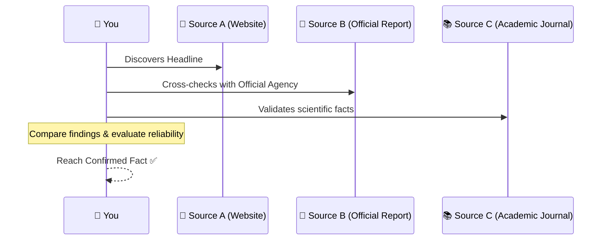
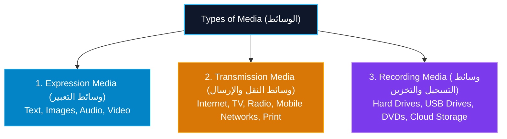
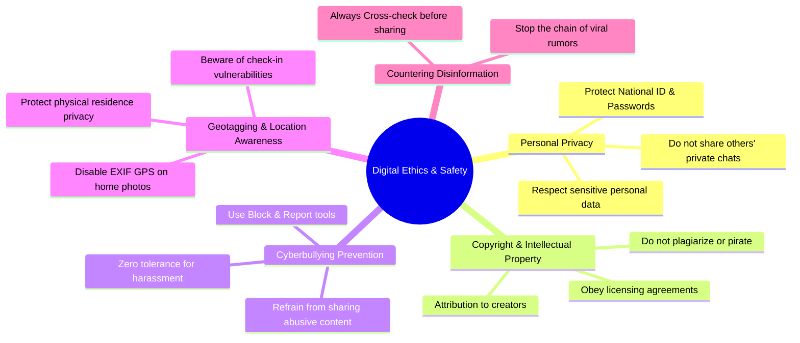
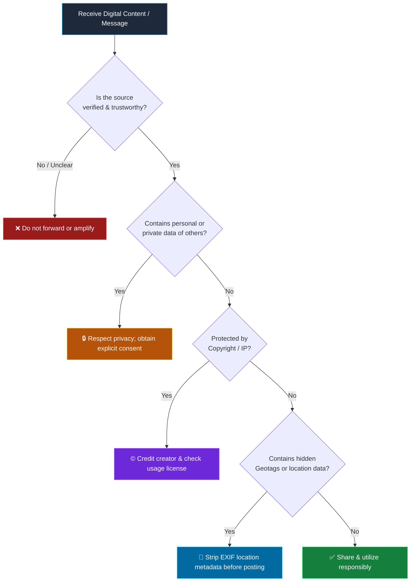
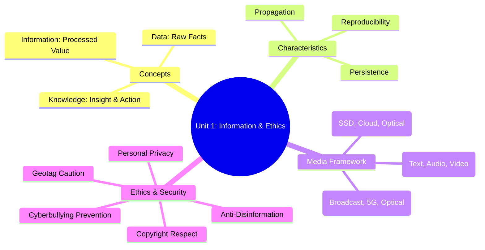

# Unit 1: Information Studies
## Information and Media + Information Ethics

> **Classroom Teaching Guide — 1st Secondary Grade**  
> Based on the official Egyptian curriculum standard, structured with interactive visualizations, animations, and real-world analogies.

---

# Part 1: Information and Media

## 1) Data, Information, and Knowledge

Let's start by breaking down the fundamental difference between three core concepts:

```
    [ Data (Raw Facts) ]
            │
            ▼ Process & Context
  [ Information (Meaning) ]
            │
            ▼ Analysis & Organization
   [ Knowledge (Action) ]
```

### A) Data
**Data** consists of raw, unorganized facts represented by:
- Numbers (e.g., `75`, `80`, `90`)
- Characters / Letters (e.g., `A`, `B`, `C`)
- Symbols (e.g., `#`, `%`, `@`)

Data by itself has no specific context or immediate meaning.


---

### B) Information
**Information** is data that has been processed, structured, or given context, giving it **meaning and value for the recipient** to help make decisions.



> **Key Rule**: Data = raw facts. Information = facts with meaning and decision-making value.

---

### C) Knowledge
**Knowledge** is information that has been systematically analyzed, combined with experience, and organized to solve problems and make strategic decisions.



> 🎯 **Core Takeaway**:  
> - **Information** tells you *what happened*.  
> - **Knowledge** tells you *why it matters and what action to take*.

---

# 2) Characteristics of Information

Digital information possesses three fundamental characteristics:



---

### A) Persistence
Once created or posted, digital information **does not easily disappear** and can persist indefinitely.

```
[ User Posts Photo ] ──► [ Server Backup ] ──► [ Search Engine Cache ]
        │
        ├── User "Deletes" Post
        └── [ Friends Saved Copies / Screenshots Exist Forever ] ⚠️
```

> **Classroom Question**: *"If I delete a post from my account, does that guarantee it's gone from the internet?"*  
> **Answer**: **No.** Digital footprints persist across caches, archives, and other users' devices.

---

### B) Reproducibility
Digital information can be **cloned and reproduced infinitely** with zero cost and zero loss of quality.

```
[ Original Master File (100% Quality) ]
        ├── Copy 1 (100%)
        ├── Copy 2 (100%)
        └── Copy N (Identical clone)
```

---

### C) Propagation
Information can be **transmitted, shared, and distributed to millions of people in seconds** via mass media and digital networks.



> ⚠️ **Caution**: Rapid propagation accelerates good communication, but it can cause severe harm when false rumors or disinformation spread unchecked.

---

# 3) Primary vs. Secondary Information



- **Primary Information**: Gathered first-hand through your own experiments, direct observations, or personal surveys.
- **Secondary Information**: Acquired through intermediaries (books, internet articles, broadcasts, third-party reports).

---

# 4) Cross-Checking Information

Because secondary sources may contain bias, inaccuracies, or incomplete context, we must perform **Cross-checking** before accepting or acting on data.



---

# 5) Media Classification

**Media** is defined as: **The methods and channels used to convey information to individuals and audiences.**



### Media Summary Matrix

| Media Type | Core Purpose | Concrete Examples |
|---|---|---|
| **Expression Media** | Expressing & representing ideas | Text, Static Photos, Voice/Audio, 4K Video |
| **Transmission Media** | Broadcasting & exchanging data across distances | TV, Radio, Optical Fiber, 5G, Satellites, Newspapers |
| **Recording Media** | Recording, storing & archiving data for retrieval | NVMe SSDs, Flash USB, Blu-Ray, Cloud Servers |

---

# 6) Media Literacy

**Media Literacy** is the ability to **critically analyze, evaluate, interpret, and produce messages across diverse media channels**.


---

# Part 2: Information Ethics & Cyber Safety

## 7) Information Ethics
**Information Ethics** comprises the moral principles, standards, and guidelines that govern the responsible creation, distribution, and consumption of information in digital society—regardless of whether explicit laws exist.

---

## 8) Key Principles of Responsible Digital Conduct



---

## 9) Safe Online Behavior Decision Tree



---

## 10) Smartphone & Social Media Hazards

1. **Internet Addiction**: Excessive screen time interfering with sleep, studies, and emotional well-being.
2. **Smartphone While Walking**: Severe accident risk caused by cognitive distraction.
3. **Cybercrime**: Illegal hacking, phishing scams, and unauthorized data breaches.
4. **Identity Theft**: Fraudsters impersonating individuals or organizations to steal credentials or assets.
5. **Leakage of Personal Information**: Unintentional exposure of confidential details to unauthorized third parties.

---

# 11) Interactive Classroom Review & Challenges

### Quick Knowledge Match
- **Question 1**: *"The ability to reproduce infinite identical digital copies without quality loss."*  
  👉 **Reproducibility**
- **Question 2**: *"Information collected first-hand via student experiments."*  
  👉 **Primary Information**
- **Question 3**: *"Embedded GPS metadata inside smartphone photos."*  
  👉 **Geotagging**
- **Question 4**: *"Methods and channels used to convey information to audiences."*  
  👉 **Media**

---

# 12) Final Unit Mind Map


