# الوحدة الأولى: دراسة المعلومات
## المعلومات والوسائط + أخلاقيات المعلومات

> **دليل الشرح التفاعلي في الفصل — للصف الأول الثانوي**  
> الشرح متوافق مع المنهج المصري ومراجع علوم الحاسب المعتمدة، ومدعوم بمخططات بصرية (Mermaid & ASCII Flows) ورسوم متحركة وتمارين تفاعلية لشرح المفاهيم بأسلوب شيق وواضح.

---

# الجزء الأول: المعلومات والوسائط

## 1) البيانات والمعلومات والمعرفة (DIKW Model)

الفرق الجوهري بين الثلاثة مفاهيم الأساسية:

```text
    ┌────────────────────────────────────────┐
    │          البيانات (Data)               │ ◄── حقائق خام غير مفسرة (أرقام، حروف، رموز)
    └──────────────────┬─────────────────────┘
                       │ معالجة وإعطاء معنى وسياق (Processing)
                       ▼
    ┌────────────────────────────────────────┐
    │        المعلومات (Information)         │ ◄── حقائق منظمة ذات معنى وقيمة لاتخاذ القرارات
    └──────────────────┬─────────────────────┘
                       │ تحليل منهجي + خبرة وتطبيق (Analysis & Action)
                       ▼
    ┌────────────────────────────────────────┐
    │          المعرفة (Knowledge)           │ ◄── فهم عميق يُستخدم لحل المشكلات واتخاذ إجراء
    └────────────────────────────────────────┘
```

### أ) البيانات (Data)
**البيانات** هي حقائق خام تُمثل باستخدام:
- **الأرقام** (مثل: `75 - 80 - 90`)
- **الأحرف والكلمات** (مثل: `أحمد - القاهرة - ممتاز`)
- **الرموز** (مثل: `% - $ - #`)

البيانات وحدها ليس لها معنى مباشر ولا يمكن اتخاذ قرار بناءً عليها بدون تفسير.

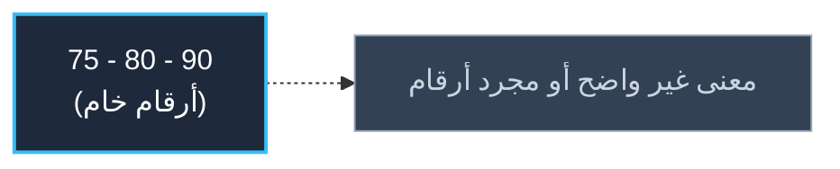

---

### ب) المعلومات (Information)
**المعلومات** هي البيانات التي تم تصنيفها أو معالجتها أو وضعها في سياق بحيث أصبح لها **معنى وقيمة للمتلقي**، وتُستخدم في اتخاذ القرارات.

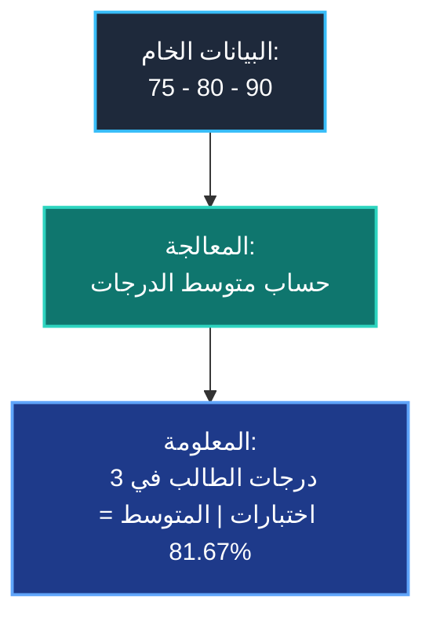

> 💡 **القاعدة الذهبية**: **البيانات = حقائق خام | المعلومات = بيانات أصبحت ذات معنى وقيمة.**

---

### ج) المعرفة (Knowledge)
**المعرفة** هي المعلومات التي تمت دراستها، وتحليلها وتنظيمها بشكل منهجي مع الخبرة البشرية للمساعدة في **حل المشكلات وتوجيه السلوك**.

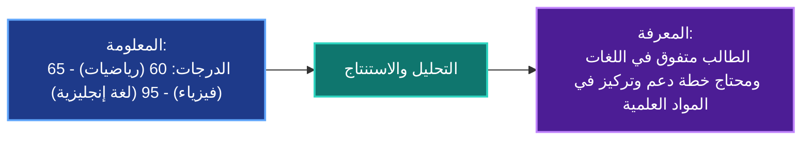

> 🎯 **الخلاصة للطلبة:**  
> - **المعلومة** بتقولك: *"إيه اللي حصل؟"*  
> - **المعرفة** بتقولك: *"ليه ده حصل؟ وإيه التصرف الصح لحل المشكلة؟"*

---

# 2) خصائص المعلومات الرقمية

تتميز المعلومات في عصرنا بثلاث خصائص رئيسية:

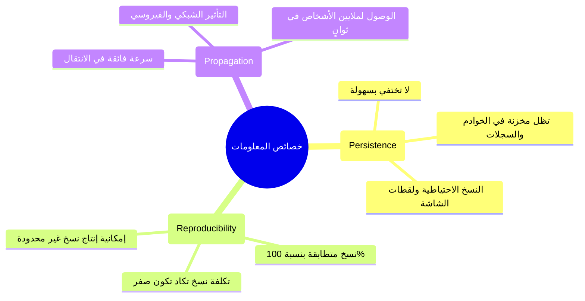

---

### أ) الاستمرارية (Persistence)
المعلومات الرقمية **لا تختفي بسهولة بمجرد إنشائها**، بل تظل موجودة ومحفوظة لفترات طويلة.

```text
[ نشر صورة أو بوست ] ──► [ خوادم الموقع ] ──► [ محركات البحث والأرشفة ]
          │
          ├── حذف المنشور من الحساب الشخصي
          └── [ وجود نسخ تم تحميلها أو لقطات شاشة مع الآخرين ] ⚠️
```

> ❓ **سؤال للمناقشة في الفصل**: *"لو حذفت بوست أو صورة من بروفايلي، هل ده يضمن إنها اختفت من على الإنترنت تماماً؟"*  
> 👈 **الإجابة**: **لا، لأن الاستمرارية تجعل نسخها محفوظة في الخوادم أو عند المستخدمين الآخرين.**

---

### ب) قابلية التكرار (Reproducibility)
المعلومات يمكن **نسخها وتكرارها وإنتاج ملايين النسخ المتطابقة منها** بسهولة ودون أي نقص في الجودة.

```text
[ الملف الأصلي 100% ]
       ├── نسخة على الكمبيوتر (100%)
       ├── نسخة على الفلاشة USB (100%)
       └── نسخة على السحابة Cloud (100%)
```

---

### ج) الانتشار (Propagation)
المعلومات من السهل جداً **توصيلها ونشرها وتوزيعها بسرعة البرق** إلى أعداد هائلة من الأفراد عبر شبكات التواصل والإنترنت.

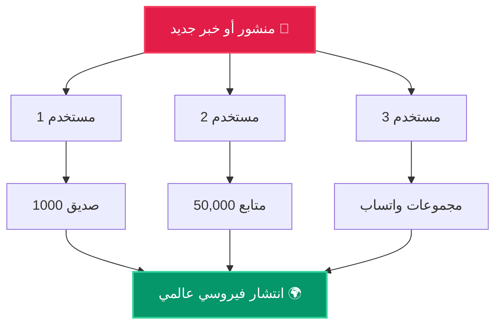

> ⚠️ **تنبيه أخلاقي**: الانتشار السريع ميزة عظيمة لنقل العلم والأخبار النافعة، لكنه سلاح خطير جداً عند نشر الشائعات والمعلومات المضللة.

---

# 3) المعلومات الأولية والمعلومات الثانوية

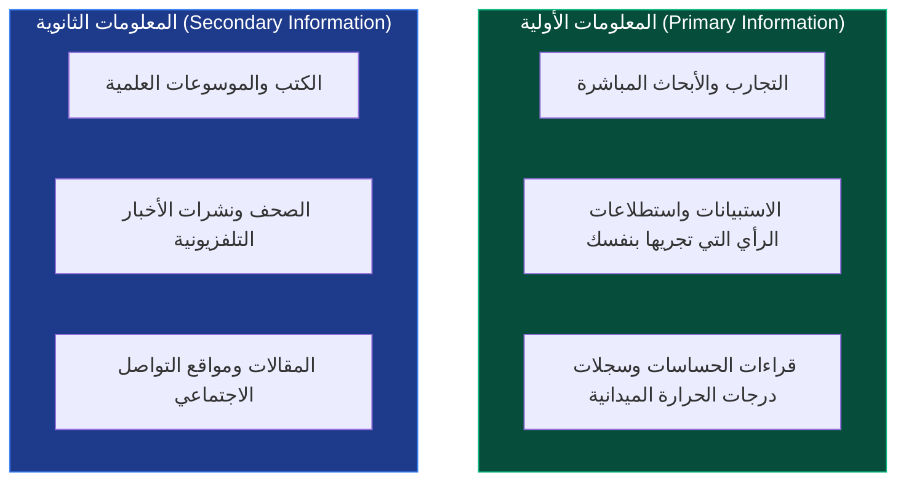

- **المعلومات الأولية**: نحصل عليها مباشرة من خلال الملاحظة، التجربة الشخصية، أو استطلاعات الرأي التي نقوم بها بأنفسنا.
- **المعلومات الثانوية**: نحصل عليها من طرف ثالث (كتاب، مقال، شخص آخر، قناة إخبارية).

---

# 4) التحقق المتبادل (Cross-Checking)

نظراً لأن المصادر الثانوية قد تحتوي على أخطاء، أو معلومات مجتزأة، أو تضليل متعمد، يجب إجراء **التحقق المتبادل** بمقارنة عدة مصادر موثوقة.

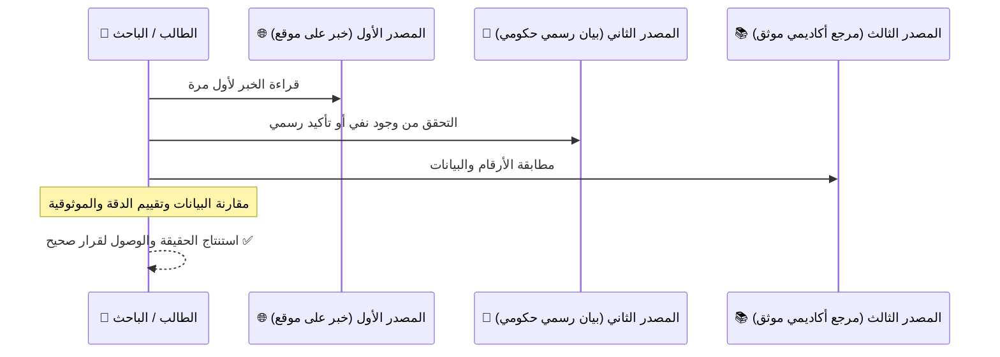

---

# 5) الوسائط (Media) وتصنيفاتها

الوسائط هي: **طرق وقنوات نقل المعلومات وتبادلها مع عدد من الأفراد.**

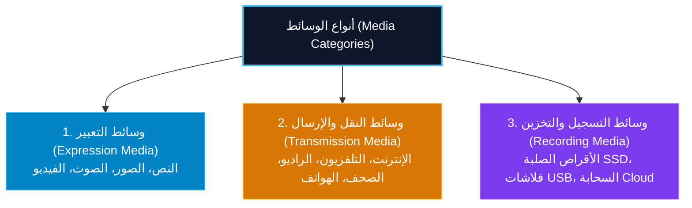

### جدول المقارنة الشامل

| نوع الوسيط | الوظيفة الأساسية | أمثلة تطبيقية |
|---|---|---|
| **وسائط التعبير (Expression Media)** | التعبير عن الأفكار والمعلومات وتجسيدها | النصوص المكتوبة، الصور الفوتوغرافية، التسجيلات الصوتية، مقاطع الفيديو |
| **وسائط النقل / الإرسال (Transmission Media)** | بث ونقل وتبادل المعلومات عبر المسافات | كابلات الألياف الضوئية، الأقمار الصناعية، شبكات 4G/5G، البث الإذاعي والتلفزيوني |
| **وسائط التسجيل (Recording Media)** | تخزين وحفظ وأرشفة المعلومات لاسترجاعها | محركات الأقراص الصلبة (HDD/SSD)، ذاكرة الفلاش (USB)، التخزين السحابي (Cloud Storage) |

---

# 6) الثقافة الإعلامية (Media Literacy)

**الثقافة الإعلامية** هي: **القدرة على فهم، وتحليل، وتفسير، وتقييم المعلومات التي نحصل عليها من مختلف الوسائط بدقة وموضوعية.**

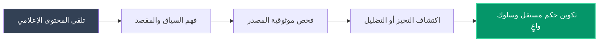

---

# الجزء الثاني: أخلاقيات المعلومات والسلوك الرقمي الآمن

## 7) مفهوم أخلاقيات المعلومات (Information Ethics)

**أخلاقيات المعلومات** هي:
> **المفاهيم والتوجيهات والمسؤوليات الأساسية اللازمة للتعامل السليم مع المعلومات في المجتمع الرقمي، سواء وُجدت قوانين ملزمة أم لم توجد.**

---

## 8) أهم مجالات الأخلاقيات الرقمية

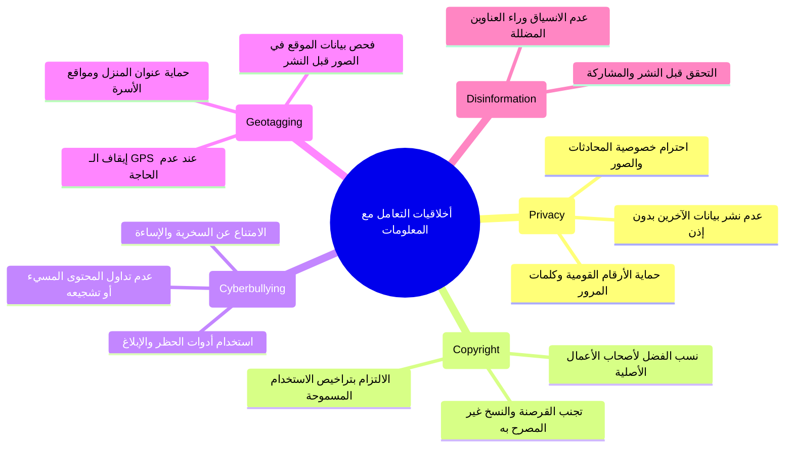

---

## 9) مخطط شجرة القرار للسلوك الرقمي الآمن

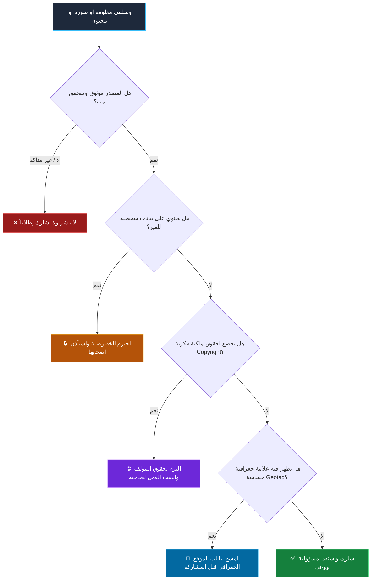

---

## 10) مشكلات الهواتف الذكية وشبكات التواصل

1. **إدمان الإنترنت (Internet Addiction)**: الاستخدام المفرط الذي يعطل الدراسة، النوم، والعلاقات الاجتماعية الطبيعية.
2. **استخدام الهاتف أثناء المشي (Walking while texting)**: خطر بالغ يشتت الانتباه ويزيد من احتمالية التعرض لحوادث السير.
3. **الجريمة الإلكترونية (Cybercrime)**: استغلال الحواسيب والشبكات في الاختراق، وسرقة الحسابات، والاحتيال المالي.
4. **انتحال الشخصية (Identity Theft)**: تقمص هوية شخص آخر أو مؤسسة لسرقة بيانات أو ابتزاز الآخرين.
5. **تسريب المعلومات الشخصية (Leakage of Personal Information)**: كشف البيانات السرية والخاصة لأطراف غير مصرح لها.

---

# 11) مواقف عملية واقعية للنقاش في الفصل

### الموقف 1: مشاركة لقطات المحادثات (Screenshots)
> **الموقف**: صديقك أرسل لك لقطة شاشة لمحادثة خاصة بينه وبين زميل وطلب منك نشرها في مجموعة الفصل.  
> **التصرف الأخلاقي**: الرفض التام، لأن المحادثات الخاصة أمانة شخصية ونشرها انتهاك مباشر للخصوصية ويسهم في إيذاء الآخرين.

### الموقف 2: التحقق من خبر فيروسي منتشر
> **الموقف**: وصلك منشور على واتساب أو فيسبوك يقول: *"عاجل: تأجيل الامتحانات أسبوعين!"* والرسالة مكتوب عليها "معاد توجيهها عدة مرات".  
> **التصرف الأخلاقي**: التوقف وعدم إعادة النشر، والدخول فوراً على الصفحة الرسمية لوزارة التربية والتعليم للتحقق المتبادل (Cross-checking).

---

# 12) الخريطة الذهنية النهائية للوحدة الأولى

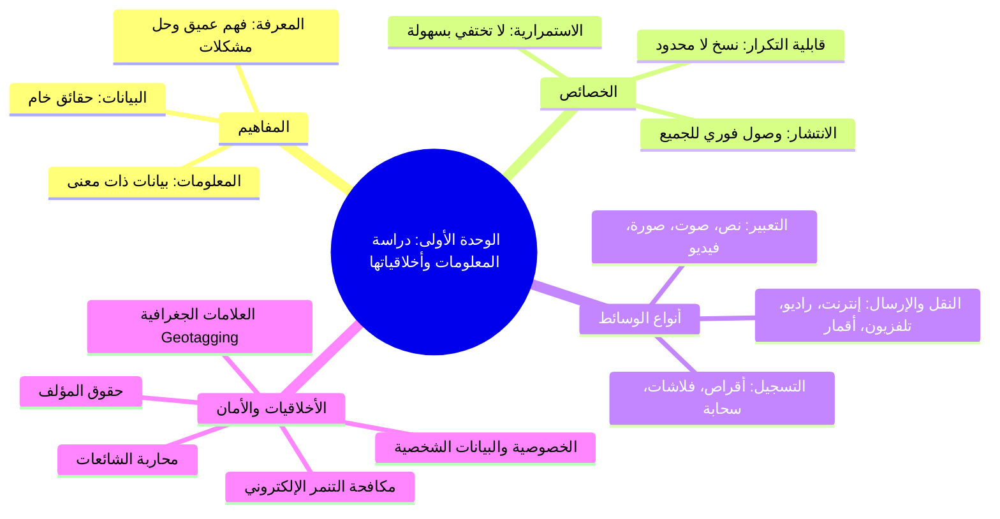

---

# 13) الجملة الختامية للمحاضرة 🎯

> **"التكنولوجيا الرقمية تمنحنا قوة هائلة لجمع المعلومات ونشرها، وتلك القوة تتطلب مسؤولية ووعياً: نفهم المعلومة، نتحقق من صحتها، نحترم حقوق وخصوصية الآخرين، ونستخدم التقنية لبناء مجتمع واعد."**
